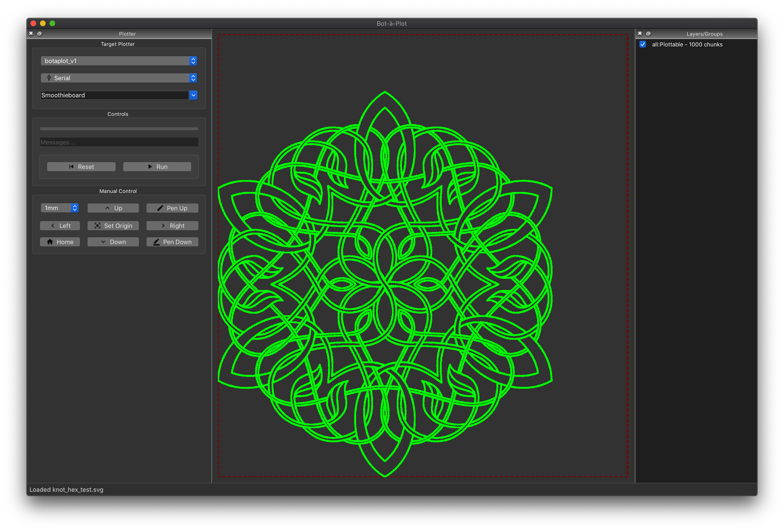

# Bot-à-Plot

TODO:
* Integrate https://github.com/mathandy/svgpathtools to generate/process SVG files
* Also use it's .point features to grab sub-segments. We can calc the length of each
  segment and use that to figure out what the per-point distance will be by dividing
  it's length by the the minimum segment length, then making sure we have that many
  points distributed equally along 0<n<1 for n points.
  
